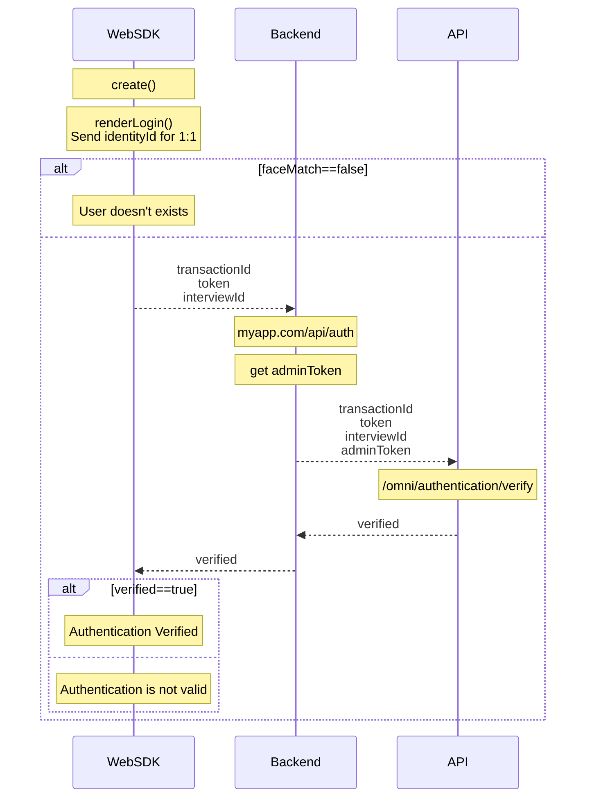

# Face Authentication Example
This sample does face authentication following the next process.



# Requirements
Vite requires Node.js version 14.18+, 16+. some templates require a higher Node.js
version to work, please upgrade if your package manager warns about it.

## Backend Server
A backend server that will generate the url is needed for this sample,
luckily for you we already have sample server NodeJS, please reffer to our documentation on subject:
[Backend Sample Server](https://developer.incode.com/docs/code-samples-for-web-integrations#backend-sample-server)

In order to simplfy development, this repo is configured to reverse
proxy a local backend server (`http://localhost:3000`) in the `/api`
url like `https://<your-ip>:5173/api`, if you want to point your
frontend development to a backend server deployed elsewhere, change
the VITE_TOKEN_SERVER_URL to the full url of such server.

# Install
Run `npm install`

# Config
Copy `.env.example` to `.env.local` and add your local values
```
VITE_TOKEN_SERVER_URL=/api
VITE_API_URL=https://demo-api.incodesmile.com
VITE_SDK_URL=https://sdk.incode.com/sdk/onBoarding-1.71.0.js

#Enable for 1:N
#VITE_CLIENT_ID=<your client id>
#VITE_API_KEY=<your api key>
```

# Run
Vite is configured to serve the project using https and and expose him self,
so you can easily test with your mobile phone on the local network.

run `npm run dev`

A new server will be exposed, the data will be in the terminal

# Build
run `npm run build`

A new build will be created in `/dist` you can serve that build everywhere
just remember to serve with https.

